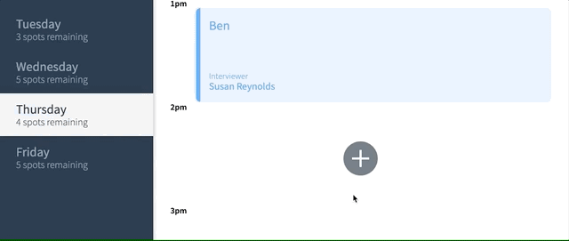
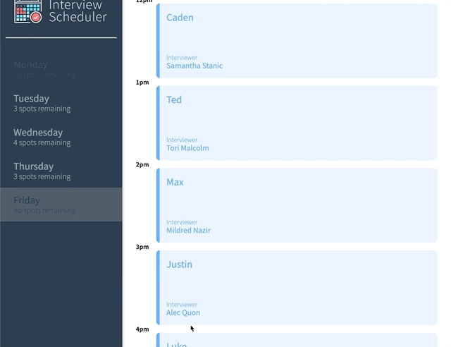

<div align="center">

#  Interview Scheduler

### Interview scheduler is a Full-Stack RESTful React Application allowing users to browse, book and cancel interviews in real time.

----

## Check it out here -  [Scheduler](https://scheduleme.netlify.app/)
 </div>

--------
*App hosted on netlifyDatabase API hosted on heroku*
* *Note: heroku database api may be in sleep mode, allow it a moment to boot up* 


# Features 
## Live, real time updates
* Utilizing a sleek Postgres API and Websockets, the application provides a live, real time view of currently booked appointments, and spots available. 

## Seamless User Experience
* Browse, add, edit, and cancel interviews seamlessly with dynamic React component rendering, no page loading.


## <ins> View Demo Below </ins>

### <ins> Create New Appointments </ins>


### <ins> Edit Existing Appointments </ins>


### <ins> Delete Appointments</ins>


# Testing
* The development of scheduler utilized Test Driven Development. 

## Utilizing
* Jest unit testing
* React-Testing-Library & Jest integration testing
* StoryBook React component testing
* Cypress End to End testing
* CircleCI deployment pipeline


# Getting Started

Fork and Clone this repositiory.

Install dependencies with `npm install`.

## Running Webpack Development Server

```sh
npm start
```

## Running Jest Test Framework

```sh
npm test
```

## Running Storybook Visual Testbed

```sh
npm run storybook
```

## Setup Database API
[scheduler-api](https://github.com/devhmac/scheduler-api)
  * Fork and clone API repo, and follow readme instructions

# Dependencies
- react
- react-dom
- react-scripts
- axios 
- classnames
- normalize.css